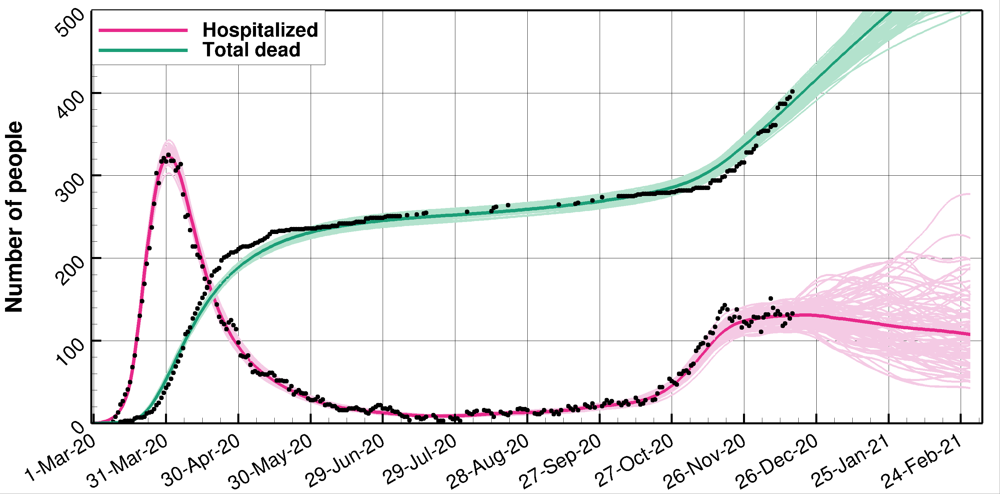

# EnKF_seir

This code uses an extended multigroup SEIR model with age classes in an ensemble data
assimilation system for predicting the spreading of the Coronavirus.
"multigroup" means that we can use the model for an arbitrary number of countries or regional compartments. 
The ensemble method is the ESMDA (Ensemble Smoother with multiple data assimilation). The
measurements are the accumulated number of deaths, the daily number of hospitalized, and the number of positive tests.
The document [multimodel.pdf](https://github.com/geirev/EnKF_seir/blob/master/doc/multimodel.pdf) describes the equations solved for
the multicompartment model configuration.

An older single-group implementation used in Evensen et al. (2020) is stored on the branch
[paper_version](https://github.com/geirev/EnKF_seir/tree/paper_version).
However, we recommend to use the new multigroup code also when running for a single country or compartment.

<p align="center">
  <a href="#installation">Installation</a> *
  <a href="#code-standards">Code standards</a> *
  <a href="#setting-up-an-experiment">Experiment setup</a> *
  <a href="#git-instructions">Git instructions</a> *
  <a href="#definition-of-time">Defintion of time</a> *
  <a href="https://github.com/geirev/EnKF_seir/blob/master/LICENSE">License</a> 
</p>

For the basic model and system description, and examples, see
http://www.aimsciences.org/article/doi/10.3934/fods.2021001

Initially, the system samples the model parameters from prescribed normal distributions.  Integration of the ensemble generates
the prior ensemble prediction. After that, we obtain the updated ensemble of model parameters from using the ESMDA method.
Finally, we integrate the model ensemble a final time to produce the posterior prediction.

<p align="center">
 
</p>

Catching the second wave!
<p align="center">
 
</p>

---

# Installation:

## 1. Building the Project

If you plan to collaborate or contribute anything to the project, use the <a href="#1b-advanced-installation">Advanced Installation</a> option.

### 1a. Basic installation

Create a directory to clone the three following repositories:

```bash
git clone git@github.com:geirev/EnKF_seir.git
git clone git@github.com:geirev/EnKF_analysis.git
git clone git@github.com:geirev/EnKF_sampling.git
```

After cloning, the directory structure should look like:

```bash
.
├── EnKF_analysis
├── EnKF_sampling
└── EnKF_seir
```

### 1b. Advanced installation

Make a personal github account unless you already have one.
Fork the three repositorys listed above.
Next clone the repositories and set upstream to the original repositories where
you need to replace <userid> with your github userid

```bash
git clone git@github.com:<userid>/EnKF_seir.git
pushd EnKF_seir
git remote add upstream https://github.com/geirev/EnKF_seir
#or, if you have set up git-ssh
#git remote add upstream git://github.com:geirev/EnKF_seir
popd

git clone git@github.com:<userid>/EnKF_analysis.git
pushd EnKF_analysis
git remote add upstream https://github.com/geirev/EnKF_analysis
#or, if you have set up git-ssh
#git remote add upstream git://github.com:geirev/EnKF_analysis
popd

git clone git@github.com:<userid>/EnKF_sampling.git
pushd EnKF_sampling
git remote add upstream https://github.com/geirev/EnKF_sampling
#or, if you have set up git-ssh
#git remote add upstream git://github.com:geirev/EnKF_sampling
popd
```

If you are new to Git, read the section <a href="#git-instructions">Git instructions</a>

## 2. Required Packages

### Linux

```bash
sudo apt-get update
sudo apt-get install libblas-dev liblapack-dev libfftw3-dev gfortran
```

### Mac

```bash
brew install gcc fftw openblas lapack
```

**Note:** You must have [Homebrew](https://brew.sh/) installed to install
packages using `brew`

## 3. Compile the `EnKF_sampling` library

Navigate to the `lib` folder of the `EnKF_sampling` repository:

```bash
cd EnKF_sampling/lib
```

then compile and place all the `.o` files as well as `libanalysis.a` into
the `build` directory of the `EnKR_seir` repository using:

```bash
make BUILD=../../EnKF_seir/build
```

## 4. Compile the `EnKF_analysis` library

Navigate to the `lib` folder of the `EnKF_analysis` repository:

```bash
cd EnKF_analysis/lib
```

then compile and place all the `.o` files as well as `libanalysis.a` into the
`build` directory of the `EnKR_seir` repository using:

```bash
make BUILD=../../EnKF_seir/build
```

**Note:** The `EnKF_analysis` repository depends on the `EnKF_sampling`
repository and therefore must be compiled second!

## 5. Compile the `EnKR_seir` library

### Linux

Navigate to the `src` folder of the `EnKF_seir` repository:

```bash
cd EnKF_seir/src
```

then compile and install the executable in the target directory, defaulting to
`$HOME/bin`:

```bash
make BINDIR=$HOME/bin
```

### Mac

Navigate to the `src` folder of the `EnKF_seir` repository:

```bash
cd EnKF_seir/src
```

then edit the following line in `EnKF_seir/src/makefile` from:

```bash
LIBS = ./libsampling.a ./libenkfanalysis.a -llapack -lblas -llapack /usr/lib/x86_64-linux-gnu/libfftw3.so.3
```

to:

```bash
LIBS = ./libsampling.a ./libenkfanalysis.a -llapack -lblas -llapack /usr/local/lib/libfftw3.a
```

then compile and install the executable in the target directory, defaulting to
`$HOME/bin`:

```bash
make BINDIR=$HOME/bin
```

## 6. Run the Project

### Linux

Navigate to the `run` directory of the `EnKF_seir` repository:

```bash
cd EnKF_seir/run2
```

and run:

```bash
seir2
```

### Mac

Create the `/usr/local/bin` directory which allows the `seir2` command to be ran
from anywhere on the local file system:

```bash
mkdir -p /usr/local/bin
```

then create a symlink for `$HOME/bin/seir2` to `/usr/local/bin`

```bash
ln -s $HOME/bin/seir2 /usr/local/bin/
```

then run the project:

```bash
cd EnKF_seir/run2
seir2
```

## 7. Plotting

If you have tecplot (tec360) there are `.lay` and `.mcr` files in the `run`
directory. For more plotting options, view `python/enkf_seir/plot`:

Note that the python plotting needs to be updated to read the multigroup output files.

```bash
python ../python/enkf_seir/plot/plot.py
jupyter-notebook ../python/enkf_seir/plot/covid.ipynb
```

---

# Setting up an experiment

The following explains how to set up and configure your simulations.

Compile the code after setting the the number of countries you will include in (nc=1 in mod_dimensions.F90).

Make a directory where you will run the code.

Initially you only need the file

```bash
run2/infile.in
```

copy the example infile.in from the run2 catalogue and run

```bash
seir2
```

This command will run an ensemble prediction without any data assimilation
and generate a number of files. We use a naming convention where all input files ends with .in, and a 3-digit number
indicates the country.  If one country is used (nc=1 in mod_dimensions.F90) then seir2 will generate the following files.


## Population:

Norwegian population numbers are hard coded and output to two template files.

```bash
population001.template  : two columns with population of males and females for each age (0-100++)
agegroups001.template   : total population for each agegroup
```

You should edit either one of these with your countries' numbers and save the chosen file to either

```bash
population001.in or agegroups001.in
```
Note that you only need to give one of these files per country.

## Initial conditions
You will need to specify some initial conditions in the file
```bash
inicond001.in  
```


## Fraction of mild, severe, and fatally ill per agegroup:
The file

```bash
pfactors001.in
```

is generated with some default values, which can later be edited and changed to reflect different situations in
different countries.

## Vaccinations
Vaccinations can be included by including the file

```bash
vaccines001.in
```

A template file vaccines001.temp is generated with some default values.

## R(t) the effective reproductive number per country
R001.in defines the effective reproductive number for country 001.  It contains an arbitrary number of lines with 
day R-value std-dev, and uses linear interpolation to generate the resulting prior R(t), which is saved to R001.dat
the next time you run the program.

The actual R-numbers are R(n,m) = RC(n,m) \*  R(t)

## R-reproduction in between agegroups:

The model contains 11 age-groups and allows for using different R numbers between different agegroups.
The default is to use the same and constant transmission numbers equal to one between all agegroups.
By specifying, the follwing matrices you can alter the transmissions among agegroups, which can also differ for the 
three different intervention periods.
The seir2 run generates the template file Rmatrix_01_001.template which you can copy to the following files and edit the numbers.
Note that the magnitudes doesn't matter since the code normalizes the matrices by an agegroup weighted norm before they are used.

```bash
Rmatrix_01_001.in
Rmatrix_02_001.in
Rmatrix_03_001.in
```

## R transmissions among countries.
The matrices RC_01.in, RC_02.in, and RC_03.in contain the intra-country transmissions for the three intervention periods.
The diagonal should be 1.0, while the offdiagonal numbers are between 0 and 1.

## Measurements of deaths, hospitalized and number of positive cases:

To condition on observations, you need to supply the measurements for each country.
corona001.in:  Contains  he observations are stored in the corona001.in file.
The file contains the following columns:

```bash
dd/mm-yyyy  "Accumulated number of deaths" "current number of hospitalized" "Accumulated number of cases"
```

A negative or zero data value will not be used.


## Random seed.
The program stores the random seed in seed.dat. Thus, next time you run the program you will use the same seed. To 
use a new seed, just delete seed.dat.

## Output files:
We store all output files in ./Outdir (or whatever you set in infile.in)
```bash
susc001_0.dat      susc001_1.dat      : Prior and posterior susceptability (accumualted)
expos001_0.dat     expos001_1.dat     : Prior and posterior exposed (current)
infec001_0.dat     infec001_1.dat     : Prior and posterior infectious (current)  
active001_0.dat    active001_1.dat    : Prior and posterior active cases (current)
case001_0.dat      case001_1.dat      : Prior and posterior cases (accumualted)
dead001_0.dat      dead001_1.dat      : Prior and posterior dead (accumualted)
hosp001_0.dat      hosp001_1.dat      : Prior and posterior hoispitalized (current)
recov001_0.dat     recov001_1.dat     : Prior and posterior recovered (accumualted)
Rens001_0.dat      Rens001_1.dat      : Prior and posterior ensemble of R(t)
par001_0.dat       par001_1.dat       : Prior and posterior ensemble of parameters

obsC001.dat        obsC001.dat        : measurements of accumulated cases (for plotting)
obsD001.dat        obsD001.dat        : measurements of accumulated deaths (for plotting)
obsH001.dat        obsH001.dat        : measurements of current hospitalizations (for plotting)
pfactors001.prior  pfactors001.posterior : The prior and posterior pfactors 
```

---

# Code standards

If you plan to change the code note the following:

I always define subroutines in new modules:

```Fortran90
module m_name_of_routine
! define global variables here
contains
subroutine name_of_sub
! define local variables here
...
end subroutine
end module
```

in the main program you write

```Fortran90
program seir
use m_name_of_routine
call  name_of_routine
end program
```

The main program then has access to all the global variables defined in the module, and
knows the header of the subroutine and the compiler checks the consistency between the call
and the subroutine definition.

make new -> updates the dependencies for the makefile
make tags -> runs ctags (useful if you use vim)

For this to work install the scripts in the ./bin in your path and install ctags

---

# Git instructions

When working with git repositories other than the ones you own, and when you expect to contribute to the code,
a good way got organize your git project is described in https://opensource.com/article/19/7/create-pull-request-github

This organization will allow you to make changes and suggest them to be taken into the original code through a pull request.

So, you need a github account.
Then you fork the repository to your account (make your personal copy of it) (fork button on github.com).
This you clone to your local system where you can compile and run.

```bash
git clone https://github.com/<YourUserName>/EnKF_seir
git remote add upstream https://github.com/geirev/EnKF_seir
git remote -v                   #   should list both your local and remote repository
```

To keep your local master branch up to date with the upstream code (my original repository)

```bash
git checkout master             #   unless you are not already there
git fetch upstream              #   get info about upstream repo
git merge upstream/master       #   merges upstream master with your local master
```

If you want to make changes to the code:

```bash
git checkout -b branchname      #   Makes a new branch and moves to it
```

Make your changes

```bash
git add .                       #   In the root of your repo, stage for commit
git status                      #   Tells you status
git commit                      #   Commits your changes to the local repo
```

Push to your remote origin repo

```bash
git push -u origin branchname   #   FIRST TIME to create the branch on the remote origin
git push                        #   Thereafter: push your local changes to your forked  origin repo
```

To make a pull request:

1. Commit your changes on the local branch

```bash
git add .                       #   In the root of your repo, stage for commit
git status                      #   Tells you status
git commit                      #   Commits your changes to the local repo
```

2. Update the branch where you are working to be consistent with the upstream master

```bash
git checkout master             #   unless you are not already there
git fetch upstream              #   get info about upstream repo
git merge upstream/master       #   merges upstream master with your local master
git checkout brancname          #   back to your local branch
git rebase master               #   your branch is updated by adding your local changes to the updated master
```

3. squash commits into one (if you have many commits)

```bash
git log                      #   lists commits
git rebase -i indexofcommit  #   index of commit before your first commit
```

Change pick to squash for all commits except the latest one.
save and then make a new unified commit message.

```bash
git push --force             #   force push branch to origin
```

4. open github.com, chose your branch, make pullrequest, check that there are no conflicts

Then we are all synced.

If you manage all this you are a git guru.
Every time you need to know something just search for git "how to do something" and there are tons of examples out there.

For advanced users:
Set the sshkey so you don't have to write a passwd everytime you push to your remote repo: check settings / keys tab
Follow instructions in
https://help.github.com/en/github/using-git/changing-a-remotes-url

To make your Linux terminal show you the current branch in the prompt include the follwoing in your .bashrc

```bash
parse_git_branch() {
     git branch 2> /dev/null | sed -e '/^[^*]/d' -e 's/* \(.*\)/(\1)/'
}
export PS1="\[\033[01;32m\]\u@\h\[\033[00m\]:\[\033[1;31m\]\w\[\033[0;93m\]\$(parse_git_branch)\[\033[0;97m\]\$ "
```

---

# Definition of time

The model uses the following definitions for time:

"Startdate" e.g., 01/03-2020 denote that the model runs from 00:00am 01/03-2020, and this time is
set to t=0.0. (see the table below)

The system integreates the ensemble of models forward one day at the time, starting from 00:00 to
24:00 and thus outputs the solutions at midnight end of the day. Thus, the output files will
contain entries like

```
 model time                                                         Output date
 0.00000E+00  Corresponds to 00:00 in the morning of the start day  (29/02-2020)
 0.10000E+01  Corresponds to 24:00 in the night of the start day    (01/03-2020)
 0.20000E+01  Corresponds to 24:00 in the night of day 2            (02/03-2020)
 0.30000E+01  Corresponds to 24:00 in the night of day 3            (03/03-2020)
 0.40000E+01  Corresponds to 24:00 in the night of day 4            (04/03-2020)
 0.50000E+01  Corresponds to 24:00 in the night of day 5            (05/03-2020)
```

## Intervention times:

If an intevention time is defined as 15/03-2020 the intervention is avtive (through values of R)
from the morning on the 15/03 at 00:00am, which corresponds to model time t>14.0. This means that
R(t) switches from R1 to R2 from the morning of 15/03. Accordingly ir swiches from 1 to 2 for using
the correct Rmat(ir).

## Measurement times

A measurement for a particular day is located at midnight that day. Thus, given a measurement from
corona.in, e.g.,

```bash
 03/03-2020    7   154   2206
```

will be located at the same time as the output of day 3, i.e., the end of the day.
